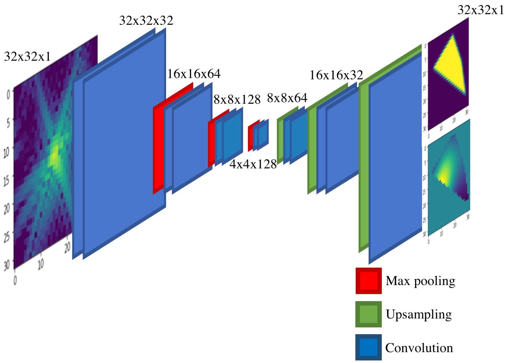

# CDI_NN
A pair of deep convolutional enoder-decoder networks that take 2D diffraction data and output the corresponding structure and phase.

This is a companion repository to the paper ["Real-time coherent diffraction inversion using deep generative networks, *Scientific Reports*, 8, 16520 (2018)"](https://www.nature.com/articles/s41598-018-34525-1)

Phase-retrieval or the iterative process of recovering lost phase information from measured intensities alone is an old problem that crops up in a variety of disciplines ranging from astronomy to X-ray, optical and electron microscopy. In the paper, we discuss the building, training and testing of a deep convolutional network that learns the mapping between diffraction data and the corresponding object and its' strain (or phase). 

The strucuture of the network is shown below:

## File Guide
The .hdf5 files have the trained network structure and weights for the structure prediction netowrk (sCDI NN in the paper) and the phase prediction network (pCDI NN in the paper).

testing.ipynb loads the trained network and shows examples of the networks' performance on the test data.

test_data folder contains the test diffraction data and corresponding object and strain (phase) information as .npy files 

## Python packages required:

Keras 2.1.0

Tensorflow 1.1.0
